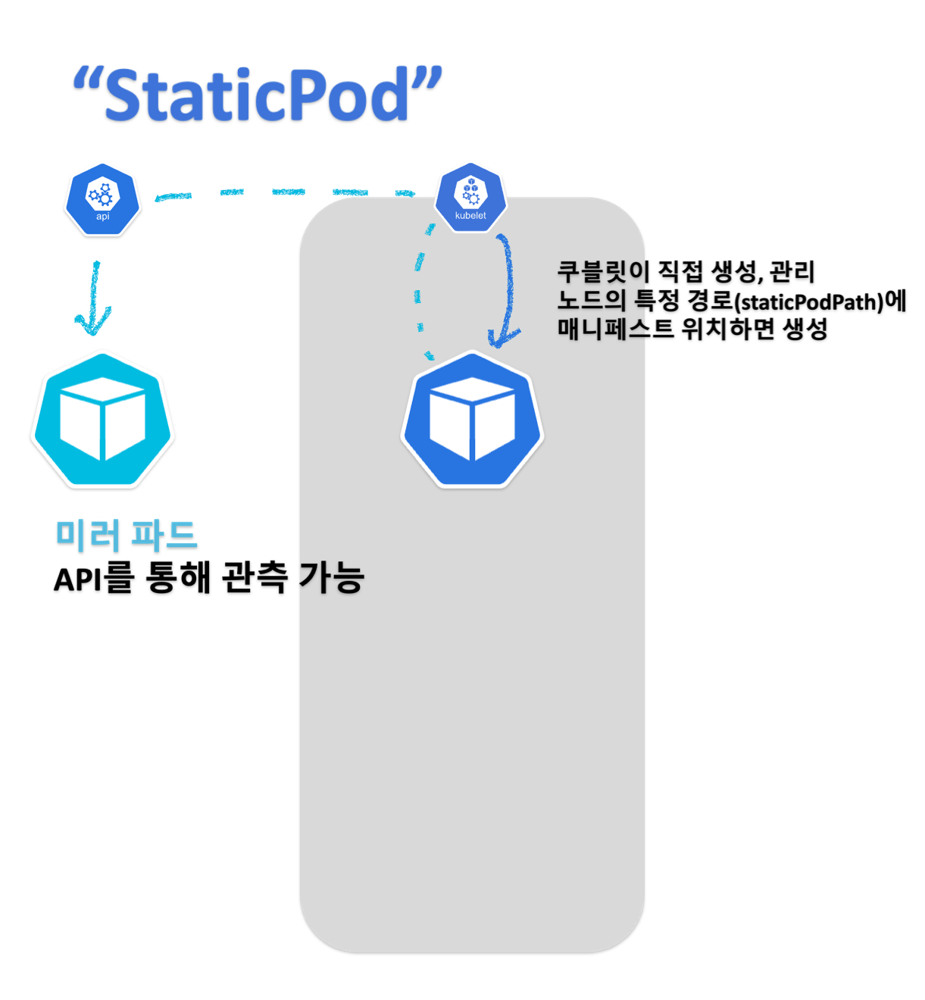

# Static Pods
<figure><figcaption><p>Static Pods</p></figcaption></figure>

정적 파드(Static Pod)는 쿠버네티스에서 파드를 직접 노드에 배치하는 방법 중 하나입니다. 정적 파드는 kubelet이 감시하는 디렉토리(`staticPodPath`)에 포함된 YAML 파일을 사용하여 정의됩니다. 이러한 파일은 파드의 스펙을 정의하며, kubelet은 이 파일을 사용하여 파드를 노드에서 실행합니다. 정적 파드를 사용하면 Kubernetes API 서버가 아닌 노드에서 파드를 실행할 수 있으므로 수동으로 관리해야 합니다.

## 정적 파드 확인
먼저 kubelet의 구성파일의 위치를 확인합니다.

```sh
$ ps aux | grep kubelet | grep config
root       12190  3.1  1.9 1796348 77208 ?       Ssl  Apr07  21:45 /usr/bin/kubelet --bootstrap-kubeconfig=/etc/kubernetes/bootstrap-kubelet.conf --kubeconfig=/etc/kubernetes/kubelet.conf --config=/var/lib/kubelet/config.yaml --container-runtime-endpoint=unix:///var/run/containerd/containerd.sock --pod-infra-container-image=registry.k8s.io/pause:3.9 --container-runtime remote --container-runtime-endpoint unix:///run/containerd/containerd.sock

# 또는
$ systemctl cat kubelet.service  | grep config
...
Environment="KUBELET_CONFIG_ARGS=--config=/var/lib/kubelet/config.yaml"
...
```

`staticPodPath`를 구성 파일에서 확인합니다.
```sh
$ cat /var/lib/kubelet/config.yaml | yq .staticPodPath
/etc/kubernetes/manifests
```

/etc/kubernetes/manifests 기본 값이고 `node-1`엔, 대부분 kube-system 네임스페이스에서 실행 중인, 클러스터 컴포넌트 파드를 확인할 수 있습니다.

```sh
$ ls -1 /etc/kubernetes/manifests
etcd.yaml
kube-apiserver.yaml
kube-controller-manager.yaml
kube-scheduler.yaml

$ k -n kube-system get po | grep node-1
etcd-node-1                      1/1     Running   0          11h
kube-apiserver-node-1            1/1     Running   0          11h
kube-controller-manager-node-1   1/1     Running   0          11h
kube-scheduler-node-1            1/1     Running   0          11h
```

스태틱 파드 이름의 특징은 뒤에 실행 중인 노드의 `-<hostname>` 접미사가 붙습니다. 따라서 이름으로 스태틱 파드임을 구분할 수도 있습니다.

파드 소유 참조(`ownerReference`)를 통해 확인하는 방법도 있습니다. 스태틱 파드는 kubelet이 생성하여 `Node`가 소유자입니다.

```sh
# e.g. etcd-node-1
$ k -n kube-system get po etcd-node-1 -oyaml | yq .metadata.ownerReferences[0].kind
Node

$ k -n kube-system get po etcd-node-1 -oyaml | yq .metadata.ownerReferences
- apiVersion: v1
  controller: true
  kind: Node
  name: node-1
  uid: 5393d007-c294-438a-8fb9-f876c094e8e6
```

## 정적 파드 생성
kubelet이 감시하는 `staticPath` 디렉토리에 YAML 파일을 생성하여 스태틱 파드를 생성합니다. `node-2`에서 생성해보겠습니다.

```yaml
# node-2:/etc/kubernetes/manifests/nginx.yaml
# k run nginx --image nginx $do
apiVersion: v1
kind: Pod
metadata:
  creationTimestamp: null
  labels:
    run: nginx
  name: nginx
spec:
  containers:
  - image: nginx
    name: nginx
    resources: {}
  dnsPolicy: ClusterFirst
  restartPolicy: Always
status: {}
```

```sh
# node-1
$ k get po nginx-node-2
NAME           READY   STATUS    RESTARTS       AGE
nginx-node-2   1/1     Running   1 (118s ago)   114s
```

이름 뒤에 `-node-2`가 붙은 것을 확인할 수 있습니다. 정적 파드는 kubelet이 생성하므로 `kubectl`로 삭제할 수 없지만 확인할 순 있습니다. 확인이 가능한 이유는 API 서버에서 스태틱 파드에 대한 미러 파드를 만들기 때문입니다.

```sh
$ k delete po nginx-node-2
pod "nginx-node-2" deleted

$ k get po nginx-node-2
NAME           READY   STATUS    RESTARTS   AGE
nginx-node-2   0/1     Pending   0          4s
```

미러 파드를 삭제하더라도 정적 파드는 삭제되지 않습니다. 위처럼 삭제하면 바로 새로 스케쥴 되는 것처럼 보입니다. 스태틱 파드 매니페스트를 수정 또는 삭제하여 스태틱 파드를 제어할 수 있습니다.


```sh
# node-2
$ rm /etc/kubernetes/manifests/nginx.yaml
```

```sh
# node-1
$ k get po nginx-node-2
Error from server (NotFound): pods "nginx-node-2" not found
```

<details>
<summary>Q1. 다음 정적 파드를 생성해보세요.
<br> - 이름: <code>staticbox</code>
<br> - 네임스페이스: <code>default</code>
<br> - 이미지: <code>busybox</code>
<br> - 명령: <code>sleep 3600</code>
<br> - 노드: <code>node-3</code>
</summary>

```yaml
# node-3:/etc/kubernetes/manifests/staticbox.yaml
apiVersion: v1
kind: Pod
metadata:
  name: staticbox
  namespace: default
spec:
  containers:
  - name: staticbox
    image: busybox
    command: ["sleep", "3600"]
```
</details>

<details>
<summary>Q2. 디플로이먼트, 대몬셋의 `ownerReference`를 확인해보세요.</summary>

```sh
# Deployment: kube-system/coredns
$ k get deploy -A
...
kube-system          coredns                                           2/2     2            2           11h

$ k -n kube-system get deploy coredns -oyaml | yq .spec.template.metadata.labels
k8s-app: kube-dns

$ k -n kube-system get po -l k8s-app=kube-dns
NAME                       READY   STATUS    RESTARTS   AGE
coredns-787d4945fb-cm6nd   1/1     Running   0          11h
coredns-787d4945fb-fbbhf   1/1     Running   0          11h

$ k -n kube-system get po coredns-787d4945fb-cm6nd -oyaml | yq .metadata.ownerReferences
- apiVersion: apps/v1
  blockOwnerDeletion: true
  controller: true
  kind: ReplicaSet
  name: coredns-787d4945fb
  uid: a0599fce-4c90-432a-8880-f10daf0d0205
```

```sh
# DaemonSet: kube-system/kube-proxy
$ k get ds -A
...
kube-system     kube-proxy        3         3         3       3            3           kubernetes.io/os=linux   11h

$ k -n kube-system get ds kube-proxy -oyaml | yq .spec.template.metadata.labels
k8s-app: kube-proxy

$ k -n kube-system get po -l k8s-app=kube-proxy
NAME               READY   STATUS    RESTARTS   AGE
kube-proxy-9gdm8   1/1     Running   0          10h
kube-proxy-tqkdz   1/1     Running   0          10h
kube-proxy-zx8q9   1/1     Running   0          10h

$ k -n kube-system get po kube-proxy-9gdm8 -oyaml | yq .metadata.ownerReferences
- apiVersion: apps/v1
  blockOwnerDeletion: true
  controller: true
  kind: DaemonSet
  name: kube-proxy
  uid: 4473a683-26e1-4446-8988-7d028017e2c8
```

</details>
