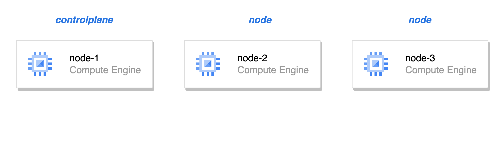

# Kubernetes Cluster Turn up(GCP)

<figure><figcaption><p>클러스터 구성</p></figcaption></figure>

### Prerequisuite

* GCP $300 크레딧 / 90일 무료 체험을 하지 않은 Google 계정
  * 새 구글 아이디를 만들어서도 가능
  * https://cloud.google.com/free/docs/free-cloud-features?hl=ko#free-trial

### Compute Engine 준비

* [GCP 콘솔](https://console.cloud.google.com/) 로 이동하여 로그인
* 프로젝트 생성(My First Project)
* Compute Engine API 활성화
  * https://console.cloud.google.com/apis/library/compute.googleapis.com
  * `사용` 버튼 클릭
* [Compute Engine](https://console.cloud.google.com/compute/instances)에서 VM 인스턴스 3대 생성(이름 제외하고 공통)
  * 리전: `asia-northeast3` (서울)
  * 이름: `node-1`, `node-2`, `node-3` (각각 1개씩)
  * 시리즈: `E2`(default)
  * 부팅 디스크
    * 운영체제: `Ubuntu`
    * 버전: `Ubuntu 20.04 LTS` (**x86/64, amd64**)
    * 디스크 크기(GB): 50

### gcloud 설치

* https://cloud.google.com/sdk/docs/install?hl=ko

```shell
$ gcloud init # 프롬프트에 전부 엔터(default)

# 또는

$ gcloud auth login
$ gcloud projects list
$ gcloud config set project <project-id>
$ gcloud compute instances list
```

### kubernetes 클러스터 설치

```shell
$ gcloud compute ssh node-1
# 최초 ssh key 생성 및 등록 필요, passphrase 없이 엔터만 입력할 것
# node-1
user@node-1:~$ sudo -i
root@node-1:~# bash <(curl -s https://raw.githubusercontent.com/flavono123/certified-kubernetes-trilogy/main/resources/gcloud-setup/controlplane.sh)
...

### node-2에서 실행 ###
kubeadm join <node-1-ip>:6443 --token xxxxxx.xxxxxxxxxxxxxxxx --discovery-token-ca-cert-hash sha256:zzzzzzzzzzzzzzzzzzzzzzzzzzzzzzzzzzzzzzzzzzzzzzzzzzzzzzzzzzzzzzzz

### node-3에서 실행 ###
kubeadm join <node-1-ip>8:6443 --token yyyyyy.yyyyyyyyyyyyyyyy --discovery-token-ca-cert-hash sha256:zzzzzzzzzzzzzzzzzzzzzzzzzzzzzzzzzzzzzzzzzzzzzzzzzzzzzzzzzzzzzzzz
```

```shell
$ gcloud compute ssh node-2
# node-
user@node-2:~$ sudo -i
root@node-2:~# bash <(curl -s https://raw.githubusercontent.com/flavono123/certified-kubernetes-trilogy/main/resources/gcloud-setup/worker.sh)
...
# node-1 명령 복사하여 실행
kubeadm join <node-1-ip>:6443 --token xxxxxx.xxxxxxxxxxxxxxxx --discovery-token-ca-cert-hash sha256:zzzzzzzzzzzzzzzzzzzzzzzzzzzzzzzzzzzzzzzzzzzzzzzzzzzzzzzzzzzzzzzz
```

```shell
$ gcloud compute ssh node-3
# node-3
user@node-3:~$ sudo -i
root@node-3:~# bash <(curl -s https://raw.githubusercontent.com/flavono123/certified-kubernetes-trilogy/main/resources/gcloud-setup/worker.sh)
...
# node-1 명령 복사하여 실행
kubeadm join <node-1-ip>8:6443 --token yyyyyy.yyyyyyyyyyyyyyyy --discovery-token-ca-cert-hash sha256:zzzzzzzzzzzzzzzzzzzzzzzzzzzzzzzzzzzzzzzzzzzzzzzzzzzzzzzzzzzzzzzz
```

```shell
# node-1
root@node-1:~# k get no
NAME     STATUS   ROLES           AGE     VERSION
node-1   Ready    control-plane   8m32s   v1.26.1
node-2   Ready    <none>          73s     v1.26.1
node-3   Ready    <none>          55s     v1.26.1

root@node-1:~# k get po -A
# 모든 파드 STATUS Running인지 확인

root@node-1:~# bash <(curl -s https://raw.githubusercontent.com/flavono123/certified-kubernetes-trilogy/main/resources/gcloud-setup/controlplane-post.sh)
```

### 방화벽 노드포트 허용
```sh
# 노드포트 대역의 방화벽 허용 규칙 생성
$ gcloud compute firewall-rules create allow-nodeport --allow tcp:30000-32767
```

### 항상 인스턴스 종료하기

그날 실습이 끝나면 항상 인스턴스를 종료합시다. 사용하지 않을 땐 꺼두어야 불필요한 비용이 발생하지 않습니다.

```sh
$ gcloud compute instances stop node-1 node-2 node-3
```

다시 실습을 시작할 땐 인스턴스를 시작하고 `node-1`에 접속하여 진행합니다.

```sh
$ gcloud compute instances start node-1 node-2 node-3
$ gcloud compute ssh node-1
```

## 클러스터 삭제(Clean up)

실습 환경 클러스터를 삭제하거나 다시 구성하고 싶을 때 사용하세요. 워커노드 2대를 삭제하고 컨트롤플레인노드를 삭제하는 순서입니다(VM은 삭제하지 않습니다).

### 워커 노드

**Drain**
```sh
# node-1
root@node-1:~# k drain node-3 --ignore-daemonsets --delete-emptydir-data --force
```

**Reset**
```sh
# node-3
root@node-3:~# bash <(curl -s https://raw.githubusercontent.com/flavono123/certified-kubernetes-trilogy/main/resources/gcloud-setup/worker-teardown.sh)
```

**삭제**
```sh
# node-1
root@node-1:~# k delete node node-3
```

(`node-2`에 대해서도 똑같이 반복)

### 컨트롤 플레인

**Reset**
```sh
# node-1
root@node-1:~# kubeadm reset -f
```
